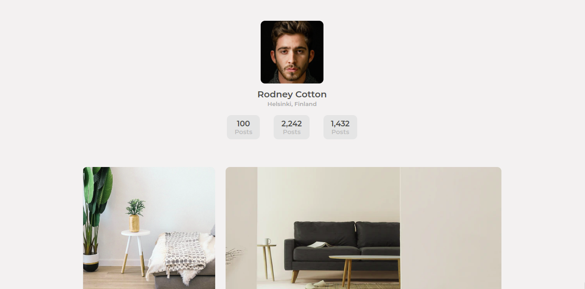
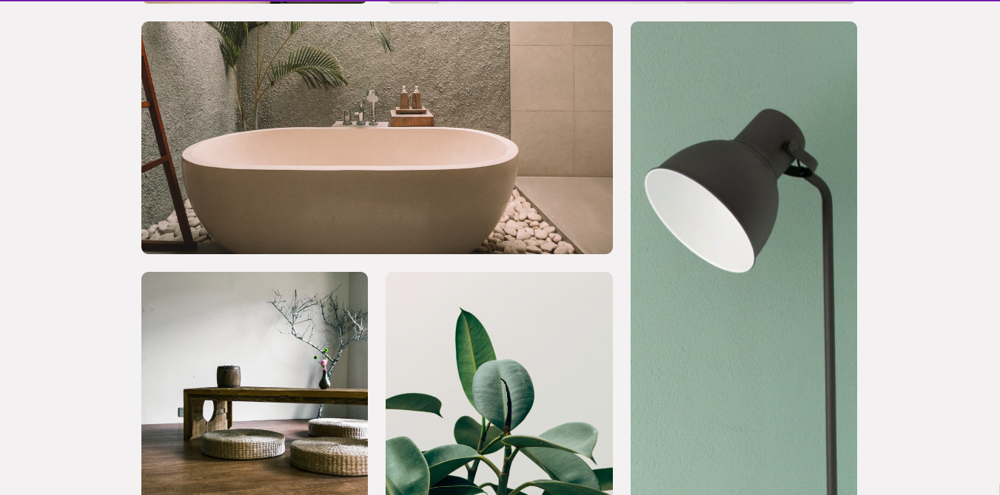
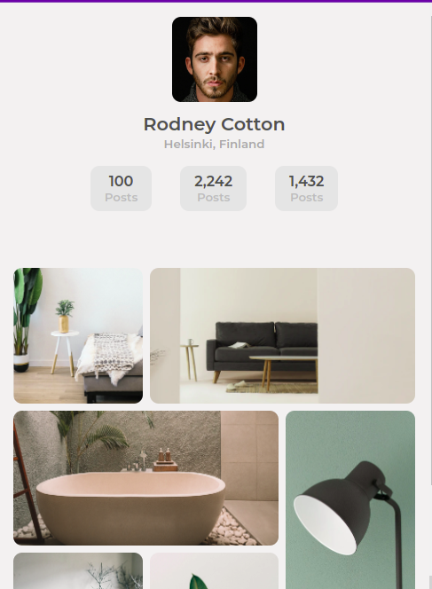

<h1 align="center">My Gallery</h1>

This project is a solution to challenge from the [Devchallenges.io](https://devchallenges.io/challenges/gcbWLxG6wdennelX7b8I) in the Responsive Web Developer Track.

Live Link : [Click Here](https://masterpranay1.github.io/my-gallery)

## Built with
- HTML5
- Super powered CSS (SCSS) 🤩
  - nesting
  - looping ( finally used in a project 😃)

## Features
- Responsive UI
- Modern Grid Layout
- Concise (to-point) CSS

## Screenshots

- Desktop 

- Mobile

## Author

Loved the Project. Let's connect 🍻

- Linkedin : [@masterpranay](https://linkedin/in/masterpranay)

